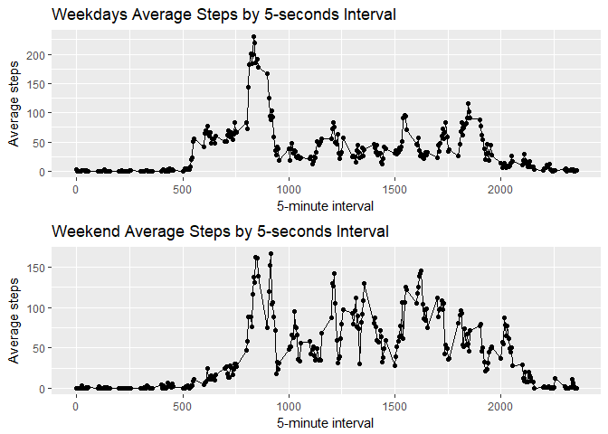

# PA1_template
Gabriel Golczer  
July 22, 2017  
# Project Week 2 Reproducible Research

This is an R Markdown document for the Week 2 Project of the Reproducible Research Course in the Data Science Specialization (Coursera -John Hopkins University).

The project makes use of data from a personal activity monitoring device. This device collects data at 5 minute intervals through out the day. The data consists of two months of data from an anonymous individual collected during the months of October and November, 2012 and include the number of steps taken in 5 minute intervals each day.

## Loading the Data into R

The data is loaded from the Git repository after is forked and cloned to my repository and then is unziped and loaded into R.

Unziping:


```r
file = "activity.zip"
if (!file.exists("activity.csv")) {
  unzip(file)
}
```
Reading the data:


```r
activity <- read.csv("activity.csv",header=TRUE, stringsAsFactors = F)
```

Convert the dates to the proper format:


```r
as.Date(activity$date)-> activity$date
```
##Make a histogram of the total of number of steps taken each day


```r
library(ggplot2)

steps_total<- ggplot(aggregate(data = activity, steps ~ date, FUN= sum),aes(x=date, y=steps))+
  geom_bar(stat="identity", position='stack')+ ggtitle("Total Steps per Day")+xlab("Day")+ylab("Steps")
ggsave(plot=steps_total,filename="steps_total.png", dpi=600)
```

```
## Saving 7 x 5 in image
```

```r
steps_total
```

<!-- -->

##Calculate the mean and median of the total number of steps taken per day:


```r
mean_median <-merge(x= aggregate(data = activity, steps ~ date, FUN= mean, na.rm=TRUE),y = aggregate(data = activity, steps ~ date, FUN= median, na.rm=TRUE),by="date")

colnames(mean_median)<- c("Date","Mean Steps per Day","Median Steps per Day")
mean_median
```

```
##          Date Mean Steps per Day Median Steps per Day
## 1  2012-10-02          0.4375000                    0
## 2  2012-10-03         39.4166667                    0
## 3  2012-10-04         42.0694444                    0
## 4  2012-10-05         46.1597222                    0
## 5  2012-10-06         53.5416667                    0
## 6  2012-10-07         38.2465278                    0
## 7  2012-10-09         44.4826389                    0
## 8  2012-10-10         34.3750000                    0
## 9  2012-10-11         35.7777778                    0
## 10 2012-10-12         60.3541667                    0
## 11 2012-10-13         43.1458333                    0
## 12 2012-10-14         52.4236111                    0
## 13 2012-10-15         35.2048611                    0
## 14 2012-10-16         52.3750000                    0
## 15 2012-10-17         46.7083333                    0
## 16 2012-10-18         34.9166667                    0
## 17 2012-10-19         41.0729167                    0
## 18 2012-10-20         36.0937500                    0
## 19 2012-10-21         30.6284722                    0
## 20 2012-10-22         46.7361111                    0
## 21 2012-10-23         30.9652778                    0
## 22 2012-10-24         29.0104167                    0
## 23 2012-10-25          8.6527778                    0
## 24 2012-10-26         23.5347222                    0
## 25 2012-10-27         35.1354167                    0
## 26 2012-10-28         39.7847222                    0
## 27 2012-10-29         17.4236111                    0
## 28 2012-10-30         34.0937500                    0
## 29 2012-10-31         53.5208333                    0
## 30 2012-11-02         36.8055556                    0
## 31 2012-11-03         36.7048611                    0
## 32 2012-11-05         36.2465278                    0
## 33 2012-11-06         28.9375000                    0
## 34 2012-11-07         44.7326389                    0
## 35 2012-11-08         11.1770833                    0
## 36 2012-11-11         43.7777778                    0
## 37 2012-11-12         37.3784722                    0
## 38 2012-11-13         25.4722222                    0
## 39 2012-11-15          0.1423611                    0
## 40 2012-11-16         18.8923611                    0
## 41 2012-11-17         49.7881944                    0
## 42 2012-11-18         52.4652778                    0
## 43 2012-11-19         30.6979167                    0
## 44 2012-11-20         15.5277778                    0
## 45 2012-11-21         44.3993056                    0
## 46 2012-11-22         70.9270833                    0
## 47 2012-11-23         73.5902778                    0
## 48 2012-11-24         50.2708333                    0
## 49 2012-11-25         41.0902778                    0
## 50 2012-11-26         38.7569444                    0
## 51 2012-11-27         47.3819444                    0
## 52 2012-11-28         35.3576389                    0
## 53 2012-11-29         24.4687500                    0
```

##Make a Time series plot of the average number of steps taken:

```r
steps_interval <- ggplot(aggregate(data = activity, steps ~ interval, FUN= mean),aes(x=interval, y=steps))+
  geom_point()+geom_line()+ ggtitle("Steps Taken per Interval")+xlab("5-minute interval")+ylab("the average number of steps taken (across all days)")

ggsave(plot=steps_interval,filename="steps_interval.png", dpi=600)
```

```
## Saving 7 x 5 in image
```

```r
steps_interval
```

<!-- -->

##The 5-minute interval that, on average, contains the maximum number of steps: 

```r
average_steps_interval <-aggregate(data = activity, steps ~ interval, FUN= mean)

colnames(average_steps_interval) <- c("5 Seconds Interval","Number of Average Steps")

average_steps_interval[which.max(average_steps_interval[,2]),]
```

```
##     5 Seconds Interval Number of Average Steps
## 104                835                206.1698
```

##Code to describe and show a strategy for imputing missing data:

- Calculate and report the total number of missing values in the dataset (i.e. the total number of rows with NAs)


```r
sum(is.na(activity$steps))
```

```
## [1] 2304
```

- Devise a strategy for filling in all of the missing values in the dataset. The strategy does not need to be sophisticated. For example, you could use the mean/median for that day, or the mean for that 5-minute interval, etc.

##Making a new data frame with no NA's , instead they have the mean for that 5-minute interval

- Create a new dataset that is equal to the original dataset but with the missing data filled in.


```r
activity_no_nas <- activity
for (i in 1:nrow(activity)){
  if(is.na(activity[i,1])){
      for(j in 1:nrow(average_steps_interval)){
        if(average_steps_interval[j,1]==activity[i,3]){
          activity_no_nas[i,1]<- average_steps_interval[j,2]
        } 
      }
  }
}
```

- Make a histogram of the total number of steps taken each day


```r
steps_nonas<- ggplot(aggregate(data = activity_no_nas, steps ~ date, FUN= sum),aes(x=date, y=steps))+
  geom_bar(stat="identity", position='stack')+ ggtitle("Total Steps per Day (no NA's)")+xlab("Day")+ylab("Steps")

steps_nonas
```

<!-- -->

```r
ggsave(plot=steps_nonas,filename="steps_nonas.png", dpi=600)
```

```
## Saving 7 x 5 in image
```

```r
steps_nonas
```

<!-- -->

- Calculate and report the mean and median total number of steps taken per day


```r
mean_median_no_nas <-merge(x= aggregate(data = activity_no_nas, steps ~ date, FUN= mean, na.rm=TRUE),y = aggregate(data = activity_no_nas, steps ~ date, FUN= median, na.rm=TRUE),by="date")

colnames(mean_median_no_nas)<- c("Date","Mean Steps per Day","Median Steps per Day")
mean_median_no_nas
```

```
##          Date Mean Steps per Day Median Steps per Day
## 1  2012-10-01         37.3825996             34.11321
## 2  2012-10-02          0.4375000              0.00000
## 3  2012-10-03         39.4166667              0.00000
## 4  2012-10-04         42.0694444              0.00000
## 5  2012-10-05         46.1597222              0.00000
## 6  2012-10-06         53.5416667              0.00000
## 7  2012-10-07         38.2465278              0.00000
## 8  2012-10-08         37.3825996             34.11321
## 9  2012-10-09         44.4826389              0.00000
## 10 2012-10-10         34.3750000              0.00000
## 11 2012-10-11         35.7777778              0.00000
## 12 2012-10-12         60.3541667              0.00000
## 13 2012-10-13         43.1458333              0.00000
## 14 2012-10-14         52.4236111              0.00000
## 15 2012-10-15         35.2048611              0.00000
## 16 2012-10-16         52.3750000              0.00000
## 17 2012-10-17         46.7083333              0.00000
## 18 2012-10-18         34.9166667              0.00000
## 19 2012-10-19         41.0729167              0.00000
## 20 2012-10-20         36.0937500              0.00000
## 21 2012-10-21         30.6284722              0.00000
## 22 2012-10-22         46.7361111              0.00000
## 23 2012-10-23         30.9652778              0.00000
## 24 2012-10-24         29.0104167              0.00000
## 25 2012-10-25          8.6527778              0.00000
## 26 2012-10-26         23.5347222              0.00000
## 27 2012-10-27         35.1354167              0.00000
## 28 2012-10-28         39.7847222              0.00000
## 29 2012-10-29         17.4236111              0.00000
## 30 2012-10-30         34.0937500              0.00000
## 31 2012-10-31         53.5208333              0.00000
## 32 2012-11-01         37.3825996             34.11321
## 33 2012-11-02         36.8055556              0.00000
## 34 2012-11-03         36.7048611              0.00000
## 35 2012-11-04         37.3825996             34.11321
## 36 2012-11-05         36.2465278              0.00000
## 37 2012-11-06         28.9375000              0.00000
## 38 2012-11-07         44.7326389              0.00000
## 39 2012-11-08         11.1770833              0.00000
## 40 2012-11-09         37.3825996             34.11321
## 41 2012-11-10         37.3825996             34.11321
## 42 2012-11-11         43.7777778              0.00000
## 43 2012-11-12         37.3784722              0.00000
## 44 2012-11-13         25.4722222              0.00000
## 45 2012-11-14         37.3825996             34.11321
## 46 2012-11-15          0.1423611              0.00000
## 47 2012-11-16         18.8923611              0.00000
## 48 2012-11-17         49.7881944              0.00000
## 49 2012-11-18         52.4652778              0.00000
## 50 2012-11-19         30.6979167              0.00000
## 51 2012-11-20         15.5277778              0.00000
## 52 2012-11-21         44.3993056              0.00000
## 53 2012-11-22         70.9270833              0.00000
## 54 2012-11-23         73.5902778              0.00000
## 55 2012-11-24         50.2708333              0.00000
## 56 2012-11-25         41.0902778              0.00000
## 57 2012-11-26         38.7569444              0.00000
## 58 2012-11-27         47.3819444              0.00000
## 59 2012-11-28         35.3576389              0.00000
## 60 2012-11-29         24.4687500              0.00000
## 61 2012-11-30         37.3825996             34.11321
```
- Do these values differ from the estimates from the first part of the assignment? 

Yes

What is the impact of imputing missing data on the estimates of the total daily number of steps?

It increases the total number of steps on days that had originally NA's

##Panel plot comparing the average number of steps taken per 5-minute interval across weekdays and weekends


```r
Day <- character(nrow(activity_no_nas))
Day_logical <- grepl("S(at|un)", weekdays(activity_no_nas$date, abbreviate = TRUE))
for(i in 1:length(Day)){
  if(Day_logical[i]==TRUE) Day[i]<- "Weekend" else Day[i]<- "Weekday"
}

activity_no_nas$day <- as.factor(Day)


library(gridExtra)

weekday_activity <- subset(aggregate(data = activity_no_nas, steps ~ interval + day, FUN= mean), day=="Weekday")
weekend_activity <- subset(aggregate(data = activity_no_nas, steps ~ interval + day, FUN= mean), day=="Weekend")

weekday_plot <- ggplot(weekday_activity,aes(x=interval, y= steps))+geom_point()+geom_line()+ ggtitle("Weekdays Average Steps by 5-seconds Interval")+ xlab("5-minute interval")+ylab("Average steps")
weekend_plot <- ggplot(weekend_activity,aes(x=interval, y= steps))+geom_point()+geom_line()+ ggtitle("Weekend Average Steps by 5-seconds Interval")+
xlab("5-minute interval")+ylab("Average steps")

weekends_weekdays <- grid.arrange(weekday_plot, weekend_plot, ncol=1)
```

<!-- -->

```r
ggsave(plot=weekends_weekdays,filename="weekends_weekdays.png", dpi=600)
```

```
## Saving 7 x 5 in image
```

```r
weekends_weekdays
```

```
## TableGrob (2 x 1) "arrange": 2 grobs
##   z     cells    name           grob
## 1 1 (1-1,1-1) arrange gtable[layout]
## 2 2 (2-2,1-1) arrange gtable[layout]
```
